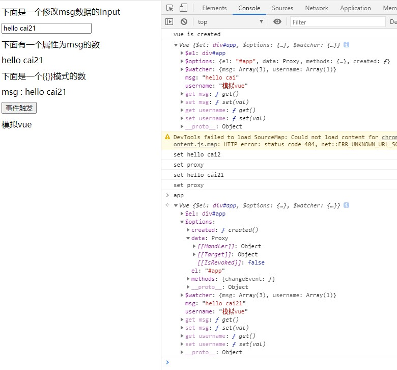

# vue-simulation

# 前言

这是一个很简单，Vue双向绑定入门级别的实现原理代码，所有代码都放到了<strong>实现vue原理.html</strong>中，没做拆分。代码是看B站的教学视频写的，原代码是vue2基于`Object.defineProperty`的实现，我在上面加了些注解和vue3的实现方式(`Proxy`,`Reflect`)

视频链接： [08-从零实现简易的Vue框架](https://www.bilibili.com/video/BV1oK4y1e7E3?p=8)

学完后受益匪浅，其中设计的知识点如下。**代码其实很简单，重要的是整个代码的设计。**

# 涉及的知识点

* 观察者模式
* Object.defineProperty 的使用
* Proxy 生成属性代理的方式
* Reflect 通过Reflect的方式来管理对象将取代Object的方式

# 界面与要实现的指令



* v-bind
* v-model
* {{}}
* @click

```html
<body>
    <div id="app">
        <div>下面是一个修改msg数据的Input</div>
        <input v-model="msg" type="text">
        <div>下面有一个属性为msg的数</div>
        <div v-bind="msg"></div>
        <div>下面是一个{{}}模式的数</div>
        <div>msg : {{msg}}</div>
        <button type="button" @click="changeEvent">事件触发</button>
        <div v-bind="username"></div>
    </div>
</body>
```

```javascript
    let app = new Vue({
        el: "#app",
        data: {
            msg: "hello cai",
            username: '模拟vue',
        },
        methods: {
            changeEvent: function () {
                console.log(this);
                this.msg = "hello vue";
            }
        },
        created() {
            console.log('vue is created');
        }
    })
```

# 实现原理

通过数据劫持的方式，监听数据元素的变换（get,set方法），当数据发生变化时，通知监听者（watcher）进行一个数据的更新。

通过Object.defineProperty的方式进行绑定，绑定的是属性与其对应的get,set。之所以无法监听数组元素内部的改变，也就是 `array[1] = '***'`，我的理解是内部的数据改变，对于这个数组本身是没有变化的所以是无法监听到的。

目前没写Object.defineProperty进行数组绑定的方式，写了个Proxy的方式，因为Proxy是可以观测到数组内部元素的改变的。

# 实现过程

##### Vue构造函数的定义
```javascript
    class Vue {
        constructor(options) {
            this.$el = document.querySelector(options.el);
            // 模拟生命周期
            if (typeof options.beforeCreate == 'function') {
                options.beforeCreate.bind(this)();
            }
            this.$options = options;
            //订阅的集合
            this.$watcher = {};
            this.proxyData();
            this.observe();
            if (typeof options.created == 'function') {
                options.created.bind(this)();
            }
            if (typeof options.beforeMount == 'function') {
                options.beforeMount.bind(this)();
            }
            this.compile(this.$el.childNodes);
            if (typeof options.mounted == 'function') {
                options.mounted.bind(this)();
            }
        }
    }
```

##### proxyData的定义，目的是为vue对象生成属性，让其可通过this[key]进行访问
```javascript
        proxyData() {
            for (let key in this.$options.data) {
                // 生成在对象上可以直接通过this.msg来访问的属性
                Reflect.defineProperty(this, key, {
                    //是否可配置
                    configurable: false,
                    enumerable: true,
                    get() {
                        return this.$options.data[key];
                    },
                    set(val) {
                        console.log(`set ${val}`)
                        this.$options.data[key] = val;
                    }
                })
            }
        }
```

##### observe的定义，此处是对this.$options.data中的属性生成一个代理对象
```javascript
        observe() {
            let that = this;
            // vue3 用上了es6的语法，使用Proxy和Reflect
            const handler = {
                get(target, key) {
                    return Reflect.get(target, key);
                },
                set(target, key, value) {
                    console.log(`set proxy`);
                    let temp = Reflect.set(target, key, value);
                    if (that.$watcher[key]) {
                        that.$watcher[key].forEach((item, index) => {
                            item.update();
                        })
                    }
                    //返回值避开严格模式下的报错
                    return temp;
                }
            }
            this.$options.data = new Proxy(this.$options.data,handler);
        }
```

结合`proxyData`与`observe`来看你会发现，在对this[key]的修改实际上会因为`this.$options.data[key] = val;`这句而转到代理类中的set方法里。最终修改和获取的是options.data里的数据

##### Watch的定义，
```javascript
    class Watch {
        constructor(vm, key, node, property, nodeType, textContent) {
            this.vm = vm;
            this.key = key;
            this.node = node;
            //Key的属性名
            this.property = property;
            //节点类型
            this.nodeType = nodeType;
            //如果是{{}}模式的话，进行设置，因为{{}}模式比较特别，需要保留源文本，进行replace
            this.textContent = textContent;
        }
        update() {
            if (this.nodeType == 1) {
                this.node[this.property] = this.vm[this.key];
            }
            //对{{}}进行特殊处理
            if (this.nodeType == 3) {
                let reg = /\{\{(.*?)\}\}/g;
                this.node[this.property] = this.textContent.replace(reg, (match, vmKey) => {
                    vmKey = vmKey.trim();
                    return this.vm[vmKey];
                });
            }
        }
    }
```

##### compile的定义，这个方法比较长，在这个方法中要对node节点进行判断和递归，在判断的过程中判断指令的类型，然后注册订阅者和其属性。
```javascript
        compile(cNode) {
            //console.log(cNode);
            cNode.forEach((node, index) => {
                //div input 属于1
                if (node.nodeType == 1) {
                    if (node.hasAttribute('v-bind')) {
                        let vmKey = node.getAttribute('v-bind').trim();
                        node.innerHTML = this[vmKey];
                        let watch = new Watch(this, vmKey, node, 'innerHTML', 1);
                        if (!this.$watcher[vmKey]) {
                            this.$watcher[vmKey] = [];
                        }
                        this.$watcher[vmKey].push(watch);
                        //将指令从Html中隐藏
                        node.removeAttribute('v-bind');
                    }
                    if (node.hasAttribute('v-model')) {
                        let vmKey = node.getAttribute('v-model').trim();
                        if (this.hasOwnProperty(vmKey)) {
                            node.value = this[vmKey];
                            let watch = new Watch(this, vmKey, node, 'value', 1);
                            if (!this.$watcher[vmKey]) {
                                this.$watcher[vmKey] = [];
                            }
                            this.$watcher[vmKey].push(watch);
                            node.addEventListener('input', event => {
                                this[vmKey] = node.value;
                            })
                            node.removeAttribute('v-model');
                        }
                    }
                    if (node.hasAttribute('@click')) {
                        node.addEventListener('click', (event) => {
                            let vmKey = node.getAttribute('@click');
                            this.$options.methods[vmKey].bind(this)(event);
                        })
                        node.removeAttribute('@click');
                    }
                    if (node.childNodes.length > 0) {
                        this.compile(node.childNodes);
                    }
                }
                //text 属于3
                if (node.nodeType == 3) {
                    let reg = /\{\{(.*?)\}\}/g;
                    let text = node.textContent;
                    node.textContent = text.replace(reg, (match, vmKey) => {
                        vmKey = vmKey.trim();
                        if (vmKey.length == 0) {
                            return match;
                        }
                        if (this.hasOwnProperty(vmKey)) {
                            node.value = this[vmKey];
                            let watch = new Watch(this, vmKey, node, 'textContent', 3, text);
                            if (!this.$watcher[vmKey]) {
                                this.$watcher[vmKey] = [];
                            }
                            this.$watcher[vmKey].push(watch);
                        }
                        return this[vmKey];
                    });
                }
            })
        }
```